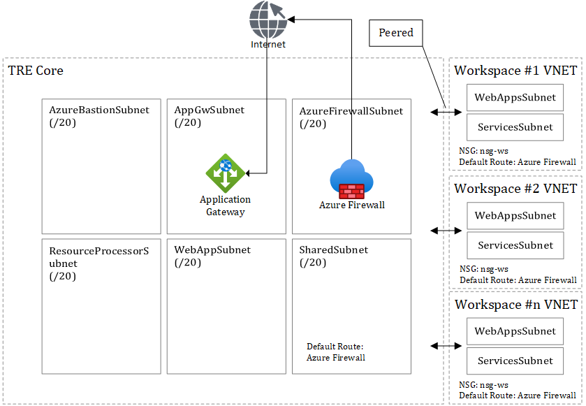

# Networking

The Trusted Research Environment (TRE) network topology is based on [hub-spoke](https://docs.microsoft.com/en-us/azure/architecture/reference-architectures/hybrid-networking/hub-spoke). The TRE Management VNET ([Azure Virtual Network](https://docs.microsoft.com/en-us/azure/virtual-network/virtual-networks-overview)) is the central hub and each workspace is a spoke.

> Note: TRE Management is referred to as **core** in scripts and code.

Azure TRE VNETs are segregated allowing limited traffic between the TRE Management VNET and Workspace VNETs. The security rules are managed by `nsg-ws` network security group. See [workspace network security groups (NSG)](#workspaces) further down.

Each workspace has a default route routing all egress traffic through the Azure Firewall, to ensure only explicitly allowed destinations on the Internet to be accessed. It is planned that all other subnet will use the same pattern (Issue [#421](https://github.com/microsoft/AzureTRE/issues/421))

The Azure Firewall rules are:

- No default inbound rules – block all.
- No default outbound rules – block all.

Inbound traffic from the Internet is only allowed through the Application Gateway, which forwards HTTPS (port 443) call to the TRE API in the `WebAppSubnet`.

| Subnet | Description |
| -------| ----------- |
| `AzureBastionSubnet` | A dedicated subnet for Azure Bastion hosts. |
| `AppGwSubnet` | Subnet for Azure Application Gateway controlling ingress traffic. |
| `AzureFirewallSubnet` | Subnet for Azure Firewall controlling egress traffic. |
| `ResourceProcessorSubnet` | Subnet for VMSS used by the Composition Service to host Docker containers to execute Porter bundles that deploys Workspaces. |
| `WebAppSubnet` | Subnet for TRE API. |
| `SharedSubnet` | Shared Services subnet for all things shared by TRE Management and Workspaces. Future Shared Services are Firewall Shared Service, Source Mirror Shared Service and Package Mirror Shared Service. |

## Network security groups

### TRE Management/core

Network security groups (NSG) and their security rules for TRE core resources are defined in [`/templates/core/terraform/network/network_security_groups.tf`](../templates/core/terraform/network/network_security_groups.tf).

| Network security group | Associated subnet(s) |
| ---------------------- | -------------------- |
| `nsg-bastion-subnet` | `AzureBastionSubnet` |
| `nsg-app-gw` | `AppGwSubnet` |
| `nsg-default-rules` | `ResourceProcessorSubnet`, `SharedSubnet`, `WebAppSubnet` |

### Workspaces

Azure TRE VNETs are segregated allowing limited traffic between the TRE Management VNET and Workspace VNETs. The rules to manage and limit the traffic between the TRE Management VNET and Workspace VNETs are defined by the `nsg-ws` network security group:

- Inbound traffic from TRE Management VNET to workspace allowed for [Azure Bastion](https://docs.microsoft.com/en-us/azure/bastion/bastion-overview) (22, 3389) - All other inbound traffic from Core to workspace denied.
- Outbound traffic to `SharedSubnet` from Workspace allowed.
- Outbound traffic to Internet allowed on HTTPS port 443 (next hop Azure Firewall).
- All other outbound traffic denied.

> In Azure, traffic between subnets are allowed except explicitly denied.

Each of these rules can be managed per workspace.
